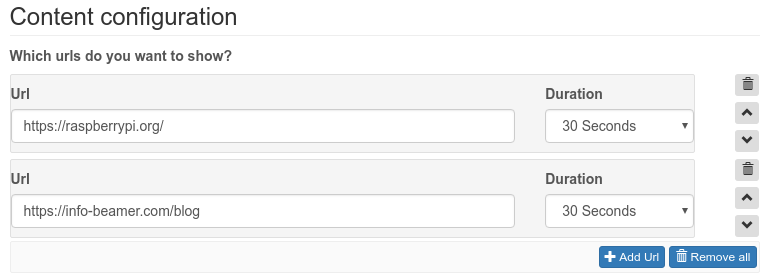

# Experimental browser for info-beamer hosted

This package allows you to show webpages in a constant rotation.
Just add the urls of the pages you want to display and their individual
display time:

# Advanced settings

## JavaScript automation

Certain pages require custom actions after loading. Most of those can
probably automated using a short JavaScript snippet that is run in the
context of the page/iframe. The Script feature allows you to do just
that. Have a look at 

https://community.infobeamer.com/t/full-screen-browser-with-login/166

for some discussion of how all that works.

## Presistent Profile

Usually the browser is started with a disposable user profile. If
you restart the Pi or switch between the browser and some other
info-beamer setup, all cookies and other browser settings are lost.

Most of the time this is actually  beneficial as no data has to be
written to the SD card and you can be sure that the browser behaves
exactly the same each time.

The persistent profile option allows you to store the chrowser
settings on your SD card instead. They then most likely survive
Pi restarts and set cookies are persistet. 

Note that you need to either restart the setup or your Pi for this
setting to have any effect.

## Custom certificates

If you use an internal CA for custom SSL certificates, you can
add their PEM formatted certificate here. They will then be
available to the browser for verification.

Note that you need to either restart the setup or your Pi for this
setting to have any effect.

# Releases

## Version 104.4

 * On Pi4/5: Work around issue when configured resolution isn't the
   native display resolution. So if you have a 4K display but set the
   Pi to use FullHD, the browser would previously still use 4K. It
   does now too, but the setup process now calculates the scaling
   factor and in the example case scales up content by 2x, so it
   matches the intended resolution.

   Note that using the new "Embedded Browser" package doesn't have
   this issue as it uses the native rendering process and fully
   respected the configured resolution. Try it out:

   https://info-beamer.com/pkg/41861

## Version 104.3

 * Fixed failing to properly wake up from power saving mode on Pi3 and older.

## Version 104.2

 * Fixed 90/270 rotation on Pi4/5
 * Improved tv on/off flow

## Version 104.1

 * Made compatible with the Pi5
 * Added language preference
 * Limit cache size

## Version 104

 * Updated bundled Chromium.
 * Added experimental ad block.
 * Added ability to specify scripts within the config UI.
 * Added detection for failed page loads and retries on error.

## Version 101

 * Updated bundled Chromium

## Version 86

 * Updated bundled Chromium
 * Restart X on rotation change

## Version 78

 * Compatibility with info-beamer OS 12 release
 * Added option to rotate content

## Version 65.4 

 * Improved interaction with power saver package
 * Added support for fetching scripts from a remote url

## Version 65.cert.3

 * Added timezone support

## Version 65.cert.2

 * Devices update their content immediately on config change
 * Fallback page if no url playlist is set
 * Unload previous page after switching to free up memory and CPU

## Version 65.cert

 * Added support for custom trusted certificates
